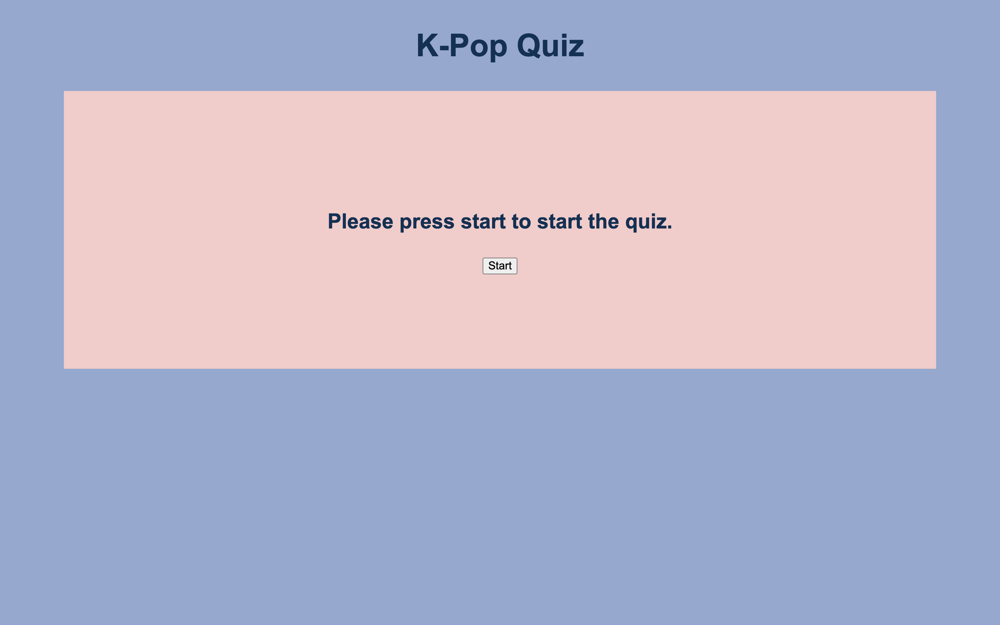
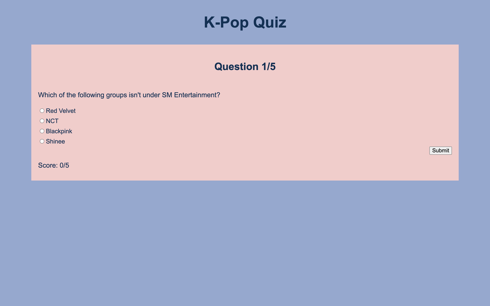
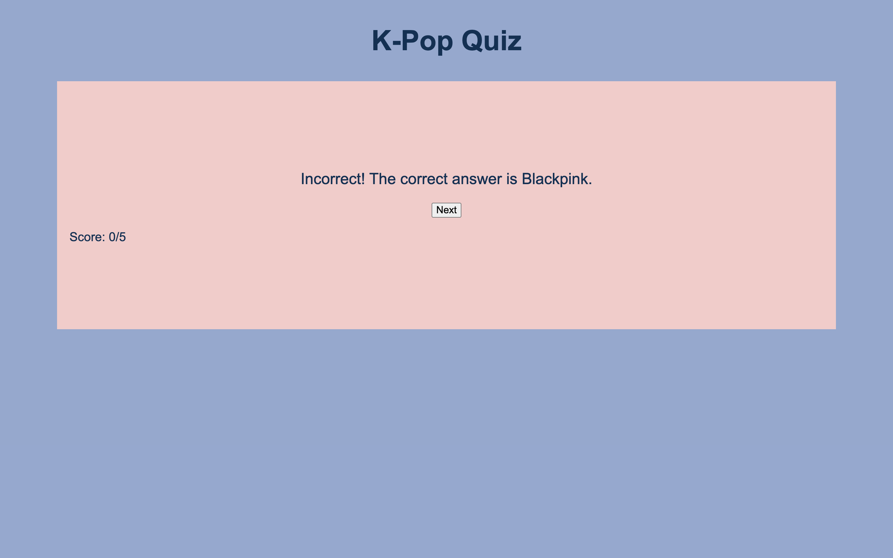
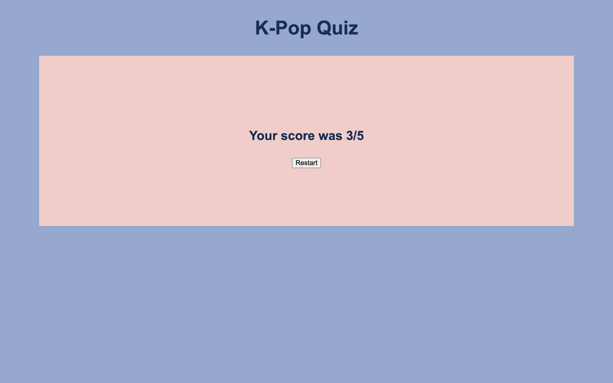

# K-pop Quiz App
https://brendanloomis.github.io/kpop-quiz-app/

A quiz app where the user can test their knowledge of K-pop.

## Screenshots
Landing Page:

Question Page:

Feedback Page:

Results Page:

## Summary

In this app the user can take a quiz that consists of 5 questions. If the user answers the question correctly, they get one point. If they answer the question incorrectly, they are told what the correct answer is. When the quiz is over, the user is shown their score, and they are able to restart the quiz.

## Technology Used

* HTML
* CSS
* JavaScript
* jQuery